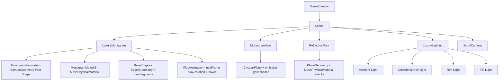
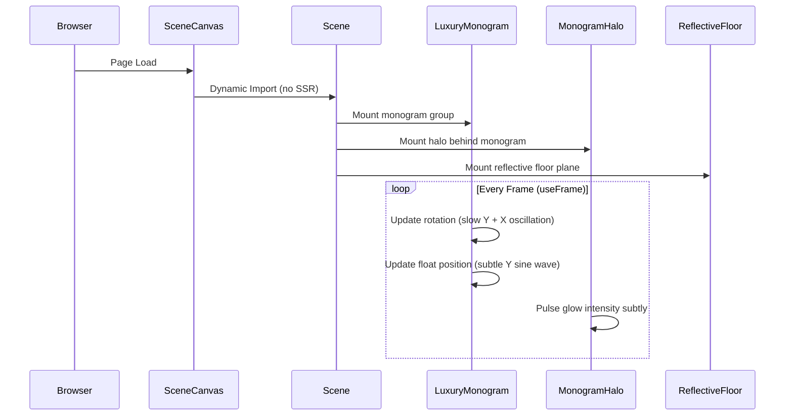
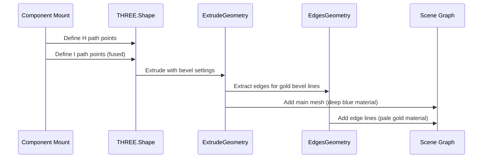

# Design Document: Luxury Monogram

## Overview

Replace the existing CreativeCore 3D blob component with a luxury minimalist "HI" monogram rendered as a premium brand mark centerpiece. The monogram will be a geometrically constructed, fused letterform rendered with brushed metallic deep blue material and pale gold bevel edges, floating in a dark navy scene with a soft glowing halo, volumetric ambient lighting, and subtle floor reflections. The animation will feature very slow floating and rotation to convey premium, sophisticated motion.

This design preserves the existing Scene/SceneCanvas/ScrollCamera architecture, replacing only the CreativeCore component (and removing the coreShader dependency) with a new `LuxuryMonogram` component and supporting scene elements (halo, floor reflection, lighting).

## Architecture



## Sequence Diagrams

### Rendering Pipeline



### Monogram Geometry Construction



## Components and Interfaces

### Component 1: LuxuryMonogram

**Purpose**: Renders the fused HI monogram with premium metallic material and slow floating animation.

**Interface**:
```typescript
interface LuxuryMonogramProps {
  /** Scale multiplier for the monogram group. Default: 1 */
  scale?: number;
  /** Whether to enable floating animation. Default: true */
  animated?: boolean;
}

function LuxuryMonogram(props: LuxuryMonogramProps): JSX.Element;
```

**Responsibilities**:
- Construct the fused HI monogram geometry using THREE.Shape + ExtrudeGeometry
- Apply brushed metallic deep blue MeshPhysicalMaterial
- Render pale gold bevel edge highlights using EdgesGeometry + LineBasicMaterial
- Animate slow floating (Y-axis sine) and rotation (Y-axis + slight X oscillation)
- Center the monogram at origin with correct proportions

### Component 2: MonogramHalo

**Purpose**: Renders a large circular glowing halo behind the monogram.

**Interface**:
```typescript
interface MonogramHaloProps {
  /** Radius of the halo circle. Default: 2.5 */
  radius?: number;
  /** Base glow intensity. Default: 0.4 */
  intensity?: number;
}

function MonogramHalo(props: MonogramHaloProps): JSX.Element;
```

**Responsibilities**:
- Render a circular plane behind the monogram (negative Z)
- Apply soft radial gradient glow using a custom shader or transparent material
- Subtle pulsing animation on emissive intensity
- Use Powder Blue color with soft falloff

### Component 3: ReflectiveFloor

**Purpose**: Renders a subtle reflective floor plane beneath the monogram.

**Interface**:
```typescript
interface ReflectiveFloorProps {
  /** Y position of the floor. Default: -1.8 */
  position?: number;
}

function ReflectiveFloor(props: ReflectiveFloorProps): JSX.Element;
```

**Responsibilities**:
- Render a horizontal plane beneath the monogram
- Apply semi-transparent reflective material (low opacity reflection)
- Dark navy color matching the scene background
- Subtle specular highlights from scene lighting

### Component 4: LuxuryLighting

**Purpose**: Provides the multi-light setup for premium metallic rendering.

**Interface**:
```typescript
function LuxuryLighting(): JSX.Element;
```

**Responsibilities**:
- Ambient fill light (low intensity, warm tint)
- Directional key light (upper right, for metallic highlights)
- Rim light (back, Powder Blue, for edge separation)
- Fill light (lower left, subtle, to prevent harsh shadows)

## Data Models

### Color Palette Constants

```typescript
const LUXURY_COLORS = {
  deepBlue: '#182350',
  powderBlue: '#AFD2FA',
  floralWhite: '#FEFAEF',
  paleGold: '#B9915E',
  background: '#0a0f1e', // darker navy for scene background
} as const;

type LuxuryColor = typeof LUXURY_COLORS[keyof typeof LUXURY_COLORS];
```

### Animation Configuration

```typescript
interface AnimationConfig {
  /** Rotation speed multiplier on Y-axis */
  rotationSpeedY: number;
  /** Rotation amplitude on X-axis (radians) */
  rotationAmplitudeX: number;
  /** Floating amplitude on Y-axis (units) */
  floatAmplitude: number;
  /** Floating frequency (cycles per second) */
  floatFrequency: number;
}

const MONOGRAM_ANIMATION: AnimationConfig = {
  rotationSpeedY: 0.08,      // very slow continuous rotation
  rotationAmplitudeX: 0.04,  // subtle tilt
  floatAmplitude: 0.06,      // gentle hover
  floatFrequency: 0.3,       // slow breathing motion
};
```

### Material Configuration

```typescript
interface MonogramMaterialConfig {
  color: string;
  metalness: number;
  roughness: number;
  clearcoat: number;
  clearcoatRoughness: number;
  envMapIntensity: number;
}

const MONOGRAM_MATERIAL: MonogramMaterialConfig = {
  color: LUXURY_COLORS.deepBlue,
  metalness: 0.85,
  roughness: 0.35,       // brushed metal look (not mirror, not matte)
  clearcoat: 0.3,
  clearcoatRoughness: 0.4,
  envMapIntensity: 1.2,
};
```

## Algorithmic Pseudocode

### Monogram Shape Construction

```typescript
function createMonogramShape(): THREE.Shape {
  const shape = new THREE.Shape();
  
  // Define the fused "HI" monogram path
  // The H and I share a vertical stroke (the right leg of H is the I)
  
  // H - Left vertical stroke
  shape.moveTo(0, 0);
  shape.lineTo(0.2, 0);
  shape.lineTo(0.2, 0.4);
  
  // H - Horizontal crossbar connecting to right stroke
  shape.lineTo(0.6, 0.4);
  shape.lineTo(0.6, 0);
  
  // H/I shared right vertical (extends full height for I)
  shape.lineTo(0.8, 0);
  shape.lineTo(0.8, 1.0);
  
  // I - Top serif/cap of the I
  shape.lineTo(0.6, 1.0);
  shape.lineTo(0.6, 0.6);
  
  // H - Crossbar top edge
  shape.lineTo(0.2, 0.6);
  shape.lineTo(0.2, 1.0);
  
  // H - Left vertical top
  shape.lineTo(0, 1.0);
  shape.closePath();
  
  return shape;
}
```

**Preconditions:**
- THREE.js library is loaded and available
- Shape coordinates produce a visually balanced monogram

**Postconditions:**
- Returns a closed THREE.Shape representing the fused HI letterform
- Shape is centered around its visual center
- All path segments are connected (no gaps)

### Float Animation Algorithm

```typescript
function updateMonogramAnimation(
  group: THREE.Group,
  elapsedTime: number,
  config: AnimationConfig
): void {
  // Very slow continuous Y rotation
  group.rotation.y = elapsedTime * config.rotationSpeedY;
  
  // Subtle X-axis oscillation (breathing tilt)
  group.rotation.x = Math.sin(elapsedTime * config.floatFrequency * 2) 
                     * config.rotationAmplitudeX;
  
  // Gentle Y-axis floating (hover effect)
  group.position.y = Math.sin(elapsedTime * config.floatFrequency * Math.PI * 2) 
                     * config.floatAmplitude;
}
```

**Preconditions:**
- `group` is a valid mounted THREE.Group reference
- `elapsedTime` is non-negative and continuously increasing
- `config` contains valid positive numeric values

**Postconditions:**
- Group rotation.y increases linearly over time (continuous spin)
- Group rotation.x oscillates within [-rotationAmplitudeX, +rotationAmplitudeX]
- Group position.y oscillates within [-floatAmplitude, +floatAmplitude]
- No discontinuities in motion (smooth sinusoidal curves)

**Loop Invariants:**
- Animation values remain bounded within their configured amplitudes
- Motion is smooth and continuous (no jumps between frames)

### Halo Glow Shader

```typescript
const haloFragmentShader = `
  varying vec2 vUv;
  uniform float uIntensity;
  uniform float uTime;
  uniform vec3 uColor;
  
  void main() {
    // Radial distance from center
    float dist = length(vUv - 0.5) * 2.0;
    
    // Soft radial falloff (Gaussian-like)
    float glow = exp(-dist * dist * 3.0);
    
    // Subtle pulse animation
    float pulse = 1.0 + sin(uTime * 0.5) * 0.05;
    
    // Final color with alpha falloff
    float alpha = glow * uIntensity * pulse;
    gl_FragColor = vec4(uColor, alpha);
  }
`;
```

**Preconditions:**
- `uIntensity` is in range [0, 1]
- `uColor` is a valid RGB vector
- `vUv` coordinates are in [0, 1] range

**Postconditions:**
- Output alpha approaches 0 at edges (smooth falloff)
- Output alpha is maximum at center
- Pulse modulation stays within ±5% of base intensity

## Key Functions with Formal Specifications

### Function: createMonogramShape()

```typescript
function createMonogramShape(): THREE.Shape
```

**Preconditions:**
- THREE.Shape class is available

**Postconditions:**
- Returns a valid closed THREE.Shape
- Shape represents fused HI letterform
- Shape bounding box aspect ratio is approximately 4:5 (width:height)

### Function: createExtrudedMonogram(shape, depth)

```typescript
function createExtrudedMonogram(
  shape: THREE.Shape, 
  depth: number
): THREE.ExtrudeGeometry
```

**Preconditions:**
- `shape` is a valid closed THREE.Shape
- `depth` is positive (recommended: 0.15–0.3)

**Postconditions:**
- Returns ExtrudeGeometry with beveled edges
- Geometry is centered at origin
- Bevel segments create smooth edge transitions

### Function: updateMonogramAnimation(group, elapsedTime, config)

```typescript
function updateMonogramAnimation(
  group: THREE.Group,
  elapsedTime: number,
  config: AnimationConfig
): void
```

**Preconditions:**
- `group` is non-null and attached to scene graph
- `elapsedTime >= 0`
- All config values are positive numbers

**Postconditions:**
- group.rotation.y = elapsedTime * config.rotationSpeedY
- |group.rotation.x| <= config.rotationAmplitudeX
- |group.position.y| <= config.floatAmplitude
- No mutations other than rotation and position

## Example Usage

```typescript
// LuxuryMonogram.tsx - Main component usage
import { useFrame } from '@react-three/fiber';
import { useRef, useMemo } from 'react';
import * as THREE from 'three';

export function LuxuryMonogram({ scale = 1, animated = true }: LuxuryMonogramProps) {
  const groupRef = useRef<THREE.Group>(null);
  
  const { geometry, edgesGeometry } = useMemo(() => {
    const shape = createMonogramShape();
    const geo = createExtrudedMonogram(shape, 0.2);
    const edges = new THREE.EdgesGeometry(geo, 30);
    return { geometry: geo, edgesGeometry: edges };
  }, []);

  useFrame((state) => {
    if (!groupRef.current || !animated) return;
    updateMonogramAnimation(groupRef.current, state.clock.elapsedTime, MONOGRAM_ANIMATION);
  });

  return (
    <group ref={groupRef} scale={scale}>
      {/* Main monogram body */}
      <mesh geometry={geometry}>
        <meshPhysicalMaterial
          color={LUXURY_COLORS.deepBlue}
          metalness={0.85}
          roughness={0.35}
          clearcoat={0.3}
          clearcoatRoughness={0.4}
        />
      </mesh>
      
      {/* Gold bevel edge highlights */}
      <lineSegments geometry={edgesGeometry}>
        <lineBasicMaterial color={LUXURY_COLORS.paleGold} transparent opacity={0.6} />
      </lineSegments>
    </group>
  );
}

// Scene.tsx - Updated scene integration
export function Scene() {
  return (
    <Canvas camera={{ position: [0, 0, 6], fov: 42 }}>
      <Suspense fallback={null}>
        <LuxuryLighting />
        <MonogramHalo radius={2.5} intensity={0.4} />
        <LuxuryMonogram scale={2.2} />
        <ReflectiveFloor position={-1.8} />
        <ScrollCamera />
      </Suspense>
    </Canvas>
  );
}
```

## Error Handling

### Error Scenario 1: Geometry Creation Failure

**Condition**: THREE.Shape path is invalid or ExtrudeGeometry receives malformed shape
**Response**: Fall back to a simple box geometry with the same material applied
**Recovery**: Log warning to console, render fallback geometry so scene is never empty

### Error Scenario 2: WebGL Context Loss

**Condition**: Browser reclaims WebGL context (common on mobile)
**Response**: Canvas automatically handles context restoration via R3F's built-in recovery
**Recovery**: Scene re-renders with same state; no special handling needed beyond R3F defaults

### Error Scenario 3: Performance Degradation on Mobile

**Condition**: Frame rate drops below acceptable threshold on low-powered devices
**Response**: Reduce geometry detail (fewer extrude segments, disable edges, simplify halo)
**Recovery**: useIsMobile hook from existing Scene.tsx provides device detection at mount time

### Error Scenario 4: Reduced Motion Preference

**Condition**: User has `prefers-reduced-motion: reduce` enabled
**Response**: Disable all animation (no rotation, no float, no halo pulse)
**Recovery**: Monogram renders static in centered default position

## Testing Strategy

### Unit Testing Approach

- Test geometry creation produces valid THREE.Shape with expected point count
- Test animation function produces values within expected bounds
- Test material configuration matches design spec colors
- Test component renders without throwing (React Testing Library + jest)

### Property-Based Testing Approach

**Property Test Library**: fast-check (TypeScript)

- Animation bounds property: for any elapsed time, rotation and position stay within configured limits
- Shape closure property: monogram shape path always produces a closed path
- Color consistency property: all rendered materials use only colors from the LUXURY_COLORS palette

### Integration Testing Approach

- Verify Scene renders LuxuryMonogram instead of CreativeCore
- Verify Particles component is removed from scene
- Verify ScrollCamera still functions with new scene composition
- Visual regression test (screenshot comparison) for final render appearance

## Performance Considerations

- ExtrudeGeometry is computed once via useMemo (no per-frame allocation)
- EdgesGeometry computed once at mount (static geometry)
- useFrame callback is lightweight (3 math operations per frame)
- Mobile: reduce extrude segments from 12 to 4, disable edge lines
- Halo shader is a simple fragment shader (no expensive raymarching)
- Reflective floor uses a single plane with material tricks (no real-time reflection computation)
- Scene maintains existing IntersectionObserver-based frameloop pause when offscreen

## Security Considerations

- No user input is processed by this component (pure visual)
- No external resources loaded (no textures, no models from CDN)
- All geometry is procedurally generated client-side
- No sensitive data involved

## Dependencies

- `three` (^0.169.0) — already installed, used for geometry, materials, shaders
- `@react-three/fiber` (^8.17.10) — already installed, React renderer for Three.js
- `@react-three/drei` (^9.114.0) — already installed, may use Environment for reflections
- No new dependencies required

## Correctness Properties

*A property is a characteristic or behavior that should hold true across all valid executions of a system—essentially, a formal statement about what the system should do. Properties serve as the bridge between human-readable specifications and machine-verifiable correctness guarantees.*

### Property 1: Animation values remain bounded

*For any* non-negative elapsed time value, the updateMonogramAnimation function SHALL produce rotation.y equal to elapsedTime × 0.08, rotation.x within [-0.04, +0.04], and position.y within [-0.06, +0.06].

**Validates: Requirements 3.1, 3.2, 3.3**

### Property 2: Animation continuity (no discontinuities)

*For any* two consecutive elapsed time values t1 and t2 where |t2 - t1| < 0.1, the difference in rotation and position values between frames SHALL be proportionally small (bounded by the time delta × maximum rate), ensuring smooth motion with no jumps.

**Validates: Requirements 3.4**

### Property 3: Halo glow intensity remains bounded

*For any* time value, the MonogramHalo pulse animation SHALL produce an intensity multiplier within [0.95, 1.05] of the base intensity, ensuring the glow never flickers or exceeds its subtle range.

**Validates: Requirements 4.3**
